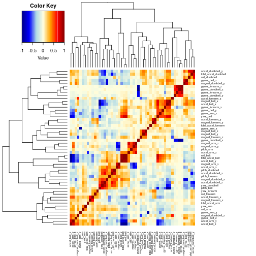
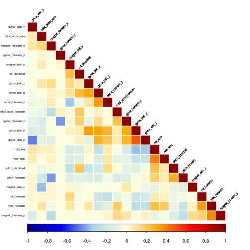

## Project writeup.

#### Background.
Using devices such as Jawbone Up, Nike FuelBand, and Fitbit it is now possible to collect a large amount of data about personal activity relatively inexpensively. These type of devices are part of the quantified self movement – a group of enthusiasts who take measurements about themselves regularly to improve their health, to find patterns in their behavior, or because they are tech geeks. One thing that people regularly do is quantify how much of a particular activity they do, but they rarely quantify how well they do it. In this project, the goal will be to use data from accelerometers on the belt, forearm, arm, and dumbell of 6 participants. They were asked to perform barbell lifts correctly and incorrectly in 5 different ways. More information is available from the website [here](http://groupware.les.inf.puc-rio.br/har). (see the section on the Weight Lifting Exercise Dataset).

#### Data.
The training data for this project are available [here](https://d396qusza40orc.cloudfront.net/predmachlearn/pml-training.csv)

The test data are available [here](https://d396qusza40orc.cloudfront.net/predmachlearn/pml-testing.csv)

The data for this project come from this [source](http://groupware.les.inf.puc-rio.br/har). If you use this document for any purpose please cite them as they have been very generous in allowing their data to be used for this kind of projects.

#### The goal of project.
The goal of this project is to predict the manner in which participants did the exercise. This is the "classe" variable in the training set. Any of the other variables can be used to predict with. Finally prediction model to predict 20 different test cases will be created. For assigment purposes the code will generate 20 files with predicted manner of witch the excersize was perform. Test cases data is a test dataset. For link see above.

## Loading and cleaning data.

#### Loading data.
The code below will check if data has been downloaded already. If not, it will download it, and load it to memory.
Training dataset should contain just below 20000 cases of 160 variables. Test dataset should be exactly 20 cases long.


```r
# Lets load some libraries and set the seed for reproducibility.
set.seed(12345)
library(caret)
library(gplots)
library(corrplot)
library(caret)
library(rpart)
library(rattle)
library(randomForest)
```

```r
## download files if they do not exist 
if (!file.exists("pml-training.csv")) {
        train_data_url <- "https://d396qusza40orc.cloudfront.net/predmachlearn/pml-training.csv"
        dest_train_file <- "pml-training.csv"
        download.file(train_data_url, dest_train_file)
}
if (!file.exists("pml-testing.csv")) {
        test_data_url <- "https://d396qusza40orc.cloudfront.net/predmachlearn/pml-testing.csv"
        dest_test_file <- "pml-testing.csv"
        download.file(test_data_url, dest_test_file)
}

# clean up
if (exists("dest_test_file", envir=environment())){
        rm(dest_test_file)
}
if (exists("test_data_url", envir=environment())){
        rm(test_data_url)
}
if (exists("train_data_url", envir=environment())){
        rm(train_data_url)
}
if (exists("dest_train_file", envir=environment())){
        rm(dest_train_file)
}

## load them into memory
training <- read.csv("pml-training.csv", na.strings = c("NA", ""))
testing <- read.csv("pml-testing.csv", na.strings = c("NA", ""))
```

#### Cleaning data.
Time to have a look at the data to decide how to clean it.

```r
# Print how many rows and columns we are dealing with at the starting point
dim(training)
```

```
## [1] 19622   160
```

```r
# summary(training)

# Summary shows lots of NAs in some of the columns. get rid of them
training <- training[,complete.cases(t(training))]
dim(training)
```

```
## [1] 19622    60
```

```r
# Now lets remove columns with no predictive values.
colnames(training)
```

```
##  [1] "X"                    "user_name"            "raw_timestamp_part_1"
##  [4] "raw_timestamp_part_2" "cvtd_timestamp"       "new_window"          
##  [7] "num_window"           "roll_belt"            "pitch_belt"          
## [10] "yaw_belt"             "total_accel_belt"     "gyros_belt_x"        
## [13] "gyros_belt_y"         "gyros_belt_z"         "accel_belt_x"        
## [16] "accel_belt_y"         "accel_belt_z"         "magnet_belt_x"       
## [19] "magnet_belt_y"        "magnet_belt_z"        "roll_arm"            
## [22] "pitch_arm"            "yaw_arm"              "total_accel_arm"     
## [25] "gyros_arm_x"          "gyros_arm_y"          "gyros_arm_z"         
## [28] "accel_arm_x"          "accel_arm_y"          "accel_arm_z"         
## [31] "magnet_arm_x"         "magnet_arm_y"         "magnet_arm_z"        
## [34] "roll_dumbbell"        "pitch_dumbbell"       "yaw_dumbbell"        
## [37] "total_accel_dumbbell" "gyros_dumbbell_x"     "gyros_dumbbell_y"    
## [40] "gyros_dumbbell_z"     "accel_dumbbell_x"     "accel_dumbbell_y"    
## [43] "accel_dumbbell_z"     "magnet_dumbbell_x"    "magnet_dumbbell_y"   
## [46] "magnet_dumbbell_z"    "roll_forearm"         "pitch_forearm"       
## [49] "yaw_forearm"          "total_accel_forearm"  "gyros_forearm_x"     
## [52] "gyros_forearm_y"      "gyros_forearm_z"      "accel_forearm_x"     
## [55] "accel_forearm_y"      "accel_forearm_z"      "magnet_forearm_x"    
## [58] "magnet_forearm_y"     "magnet_forearm_z"     "classe"
```

```r
# leave columns which names contain arm, belt, dumbbell, forearm nad column classe
training <- training[ ,grep("arm|belt|dumbbell|forearm|classe", names(training))]
dim(training)
```

```
## [1] 19622    53
```

```r
# Quick look at variables to find any with near zero variance.
near_zero_var <- nearZeroVar(training, saveMetrics = TRUE)
if (any(near_zero_var$nzv)) nzv else
        message("No near zero variance in training data")
```

```
## No near zero variance in training data
```

```r
rm(near_zero_var)

# Display correlated and clustered variables using a heat map.
plot_data <- cor(subset(training, select = -classe))
plot_color <- colorRampPalette(c("darkblue",
                                 "blue",
                                 "lightblue",
                                 "lightyellow",
                                 "orange",
                                 "red",
                                 "darkred"))(n = 100)

heatmap.2(plot_data,
          col = plot_color,
          dendrogram = "both",
          density.info = "none",
          trace = "none",
          margins = c(5, 10),
          key = TRUE,
          scale = "none",
          cexRow = 0.5,
          cexCol = 0.5)
```

 

```r
# Now we can remove strongly corellated variables.
plot_data <- findCorrelation(plot_data, cutoff = 0.5)
training <- training[, -plot_data]
dim(training)
```

```
## [1] 19622    22
```

```r
# This leaves us with just 21 variables (predictors) and one outcome.
# Take a closer look at whats left
plot_data <- cor(subset(training, select = -classe))
corrplot(plot_data,
         method = "color",
         col = plot_color,
         type = "lower",
         order = "hclust",
         tl.cex = 0.5,
         tl.col = "black",
         tl.srt = 45)
```

 

```r
# Now we see there is no more strongly correlated variables.
# Clean up
rm("plot_data", "plot_color")
```

